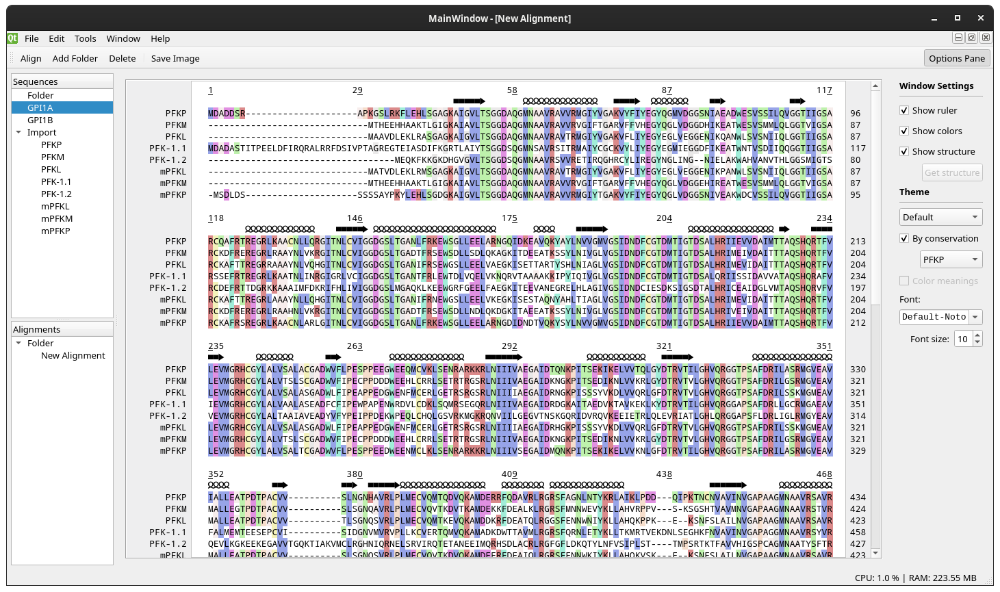

# NOTE -- THIS IS DEPRECATED AND BEING REWRITTEN IN C++
The python version is horribly buggy, so I've been tackling a complete rebuild. You can find the [new version here](https://github.com/beowulfey/linnaeo).


## [Click here for binary downloads](https://github.com/beowulfey/pylinnaeo/releases) ##
(Only the latest release has binaries here at the moment)

After downloading, there are some tips on using it located [further down](https://github.com/beowulfey/pylinnaeo#How-do-I-use-it)

Quick note -- this program is still being actively developed. Although progress has slowed with the reopening of the world, I am going to keep trying to improve on it. It's not quite feature complete but it works pretty well for what I originally intended to make; I will admit it's not very stable though. If you like it but find something is missing or broken, please leave a note in the issues tab. 

Thanks! --beowulfey

# LINNAEO #

Linnaeo is a python program I made mostly as an exercise in learning how to code a GUI... but also to solve a
basic problem I had: nothing out there is very good for making, storing and viewing protein alignments.

#### Protein alignments? ####

Yes, out there in the world are countless amino acid sequences, and their sequences (and small differences) are connected to
protein functions... but it's often hard to see that. This program is intended to help with this
by meeting a few basic criteria:

1) It should be fast.
2) It should store any sequence you want. (but right now, just FASTA protein sequences, sorry)
3) It should be easy to create, store, and export alignments.

That's a basic idea. Most likely those criteria will change.

#### Nice. What's it look like? 

Here is a screenshot as of Jun 14, 2020:



Here's another more recent screenshot from the Windows version, showing the "Conservation" theme and the tooltip feature for seeing different sequence residue numbers of the different aligned sequences:


An explanation of the themes I've designed (thus far) is [available here](https://beowulfey.github.io/linnaeo/linnaeo/resources/docs/themes).


#### What's the latest? 
New for v0.4.0 (devel branch only):
* ClustalO now returns the alignment order, rather than as the input order. This required a custom Clustalo-Python extension (also here on my github), so it is not a part of master right now. 

New for v0.3.2: 
* Added a mini-terminal for MacOS, since it runs windowed and without a terminal as a .app
* greatly improved memory usages (so many dels!)
* Changed over to an installer for Windows
* added an icon and cleaned it up

New additions for v0.2.0:
* Can now load multiple sequences and alignments at once. 
* Secondary structure search and display thanks to DSSP
* Reference sequence selection for only highlighting residues that are the same. 
* Lots of other small improvements. 

Previous additions for v0.1.6: 
* Import/export of protein sequences and alignments
* Save/Load workspaces to keep your work
* Combine sequences as needed to make new alignments using ClustalO
* Sequences and alignments can be renamed and organized in subfolders as needed
* Alignments wrap dynamically within the size of the window
* Includes a ruler and a tooltip popup on click that shows the currently highlighted residue (and the corresponding numbers for the other sequences)
* Preliminary residue theming, multiple themes available (more to come, subject to change)
* Font and point size selection for the window
* Can export the alignment window to PNG. 

### What's up next?

There is a lot I still want to do! Check out the "Issues" tab for stuff I know is broken. A quick list of features I want to add:

* Currently only supports the Clustal Omega algorithm, and calls it even for just two sequences
* I want to add better drag-and-drop functionality, such as dragging a new sequence onto an alignment window, deleting sequences from an alignment, or rerranging the order (the former 2 would be non-destructive)
* I want to improve the color themes
* I want to make a dark theme for the app itself
* Residue annotations for marking comments and observations. 

#### How do I get set up? ####
> NOTE: The latest version (v0.4.0-pre) is based on the DEVEL branch, and uses a modified clustalo-python extension. This is so I can return the alignment order from clustalo (instead of just outputting the input order!) but makes it tougher to standardize. Please be aware that to run the devel branch you'll need to clone and build my clustalo-python repository (available here too) to get that to work! 

##### [See releases here](https://github.com/beowulfey/pylinnaeo/releases) #####
I've attempted to build portable binaries for all Mac and Windows. Hopefully they work, but I'm still learning this part. 

If you want to try building it yourself, or they don't work, here are some instructions:

###### Linux
If you're on linux it's a good bet you've done something like this before. Here's the basic process:
* Create a new virtualenv 
* Clone the github into a folder and start up your virtualenv
* Install everything required to run and fire it up.

Try my prebuilt ClustalO for python wheel, but if it doesn't work you'll have to go through the steps to compile ClustalO and the wrapper yourself (see the Mac section for tips). 
```
pip install -r requirements.txt
pip install install/clustalo-0.1.2-cp38-cp38-linux_x86_64.whl
python setup.py build install
python -c 'import linnaeo;linnaeo.main()
```

###### MAC
Let's say you want to try and build it from source... maybe the latest devel version or something. Here's how.
Install homebrew if you don't have it... it will make your life significantly easier. 
Then follow these steps:
```
brew install python3
pip3 install virtualenv
brew install clustal-omega
brew install openmpi
```
Move to where you want the app to live and clone Linnaeo, and prep your env:
``` 
cd ~/devel
git clone https://github.com/beowulfey/linnaeo.git
cd linnaeo
python3 -m virtualenv venv
source venv/bin/activate
```
Install PyClustalo into it first. This is the trickiest one, and I hope it works for you. 
```
export CC=gcc-9
pip3 install --global-option=build_ext --global-option="-I/usr/local/include/clustalo" --global-option="-L/usr/local/lib" clustalo
``` 
Finally, install linnaeo, and run the program.
```
python3 setup.py build install
python3 -c 'import linnaeo; linnaeo.main()
```

Note that if you want to use the DSSP feature, you'll also have to build and install a DSSP binary to your PATH. Unfortunately I don't think DSSP is included in Homebrew anymore. However, the binaries I uploaded should have a working binary and don't need anything externally. 

###### Windows
Install Anaconda3 and create a new environment:

```
conda create env --name linnaeo python=3.7
conda install -c speleo3 dssp
cd C:\Users\<You>\devel\ 	# or where ever you want it to live
git clone https://github.com/beowulfey/linnaeo.git
cd linnaeo
pip install install/clustalo-0.1.2-cp37-cp37m-win_amd64.whl
pip install -r requirements.txt
python setup.py build install
```
On Windows, I have a pre-compiled clustalo wheel file that seems to usually work. Please let me know if it doesn't. 


#### How do I use it?
Once opened you'll be greeted with the main window. Try opening up some previously-downloaded sequence files or other alignments you have made (only clustal format--.clustal or .aln--or fasta files though, sorry). You can also copy a fasta-formatted sequence and paste it directly into the program. 

Sequences and alignments can be renamed or organized in folders. I recommend getting your sequences from [UniProt](https://www.uniprot.org) as I've integrated it into the DSSP search function (it uses the sequence ID). 

Renaming a sequence won't change the underlying ID, so feel free to call it whatever you like! You can access the ID by copying out a sequence or exporting it. Exporting an alignment uses the displayed names instead. 

Highlight a few sequences (hold ctrl) and either double click or hit the align button to create a new alignment. 

There is also an options panel that allows for choosing a font, theme, increase the font size, etc. 

Finally, try holding the mouse button down on a residue within the alignment window--you'll see the residue ID (and equivalent ids for the aligned sequences) in a tooltip popup!

Enjoy, and hope it works for you, the intrepid early tester! I appreciate your feedback! 


#### Special thanks

Repositories I am eternally grateful for -- they helped me get this onto windows -- and need to cite:

* [ARGTABLE2](https://github.com/jonathanmarvens/argtable2) -- for building Clustal Omega on Windows
* [Clustal Omega, adapted to use CMake (so, so grateful) from GSL Biotech](https://github.com/GSLBiotech/clustal-omega/tree/master/src)

Other core parts of the software that are awesome too:
* Biopython
* Bioservices
* and of course, PyQt5

And most importantly, all the folks who are helping me test this out!
